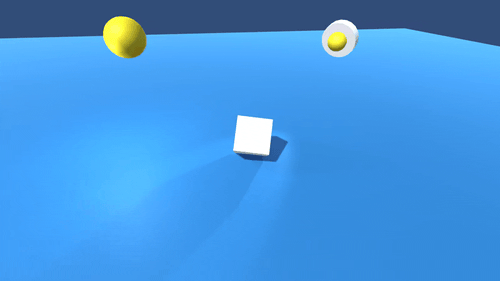

# Kage
Casting shadows on an invisible plane.

UPDATE 2022/09/27:
 - Now support multiple lightings
 - Now support directional, point and spot lights

[Watch this video on YouTube](https://youtu.be/Iku6OCW7sTQ)

[Watch this viedo on YouTube](https://youtu.be/YGo8sTYMJ68)

Unity version: `2019.4.29f1` (It might work on any version of Unity.)

## Limitations
 - Only works for Built-in Rendering Pipeline
 - Does not work for `Skybox`. change your camera background to `Solid Color`.

## Tutorial

Set the `Cast Shadows` option to `Off` of your model that only draw shadows, then attach the `TransparentShadow` Material/Shader to it.

### Point lights and spot lights

Don't forget to enable the `Shadow Type` option of the lights.

